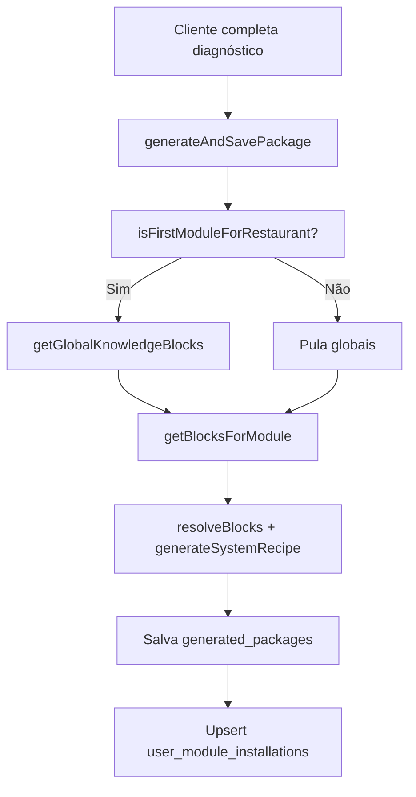

# Design: Blocos globais compartilhados com injeção no primeiro módulo

**Data:** 2026-06-17  
**Status:** Aprovado pelo usuário  
**Escopo:** Geração de pacotes, admin de blocos, migrations

## Problema

Hoje os blocos compartilhados (**Estrutura Base**, **Regra Anti-Duplicação**, **Regra de Planejamento Obrigatório**) precisam ser vinculados manualmente a cada módulo via `module_knowledge_blocks`. Isso gera redundância no admin e repete conteúdo no prompt final — mesmo quando o cliente já implementou a base no projeto externo.

Na migration `01`, o módulo Ficha Técnica já tem os 4 vínculos (3 globais + 1 específico), ilustrando o problema.

Além disso, o fluxo do cliente envia `installedModules: []` fixo em `ModuleFlow.tsx`, então a lógica de “primeiro módulo” existente em `generate-system-recipe.ts` nunca é acionada na prática.

## Objetivo

- Blocos globais (`type: base` e `global_rule`) são **compartilhados pela plataforma**, não vinculados por módulo.
- Na geração do pacote, globais entram **somente se for o primeiro módulo do restaurante** (critério A: histórico em `user_module_installations`).
- No admin, cada módulo gerencia **apenas blocos específicos**; globais têm tela própria sob o menu Módulos.
- Nos módulos seguintes, o prompt final contém **somente o bloco específico** — os globais já viraram arquivos no projeto do cliente.

## Decisões de produto

| Decisão | Escolha |
|---------|---------|
| Critério “já tem sistema” | Histórico na plataforma (`user_module_installations`) |
| Quando incluir globais | Somente no primeiro módulo do restaurante |
| O que são globais | Blocos com `type in ('base', 'global_rule')` |
| O que é específico | Blocos vinculados ao módulo via `module_knowledge_blocks` |
| Onde editar globais | `/admin/modulos/globais` (sem novo item na sidebar) |
| Onde editar específicos | Painel de edição de cada módulo (como hoje) |
| Regras globais no 2º módulo | Não incluir (viram arquivos salvos no projeto) |
| Menu admin | Manter um único item “Módulos” na sidebar |

## Regra de negócio: primeiro módulo

```text
isFirstModule(restaurantId, currentModuleId?) =
  NÃO existe instalação em user_module_installations
  para o mesmo restaurant_id
  com status IN (
    'package_generated',
    'implementation_started',
    'installed',
    'validated'
  )
  em módulo DIFERENTE de currentModuleId (quando informado)
```

**Regeração do mesmo módulo:**
- Se é o único módulo gerado do restaurante → inclui globais.
- Se já existe outro módulo gerado → não inclui globais.

## Montagem do prompt

```text
SE isFirstModule:
  blocos = getGlobalKnowledgeBlocks() + getBlocksForModule(moduleId)
SENÃO:
  blocos = getBlocksForModule(moduleId)
```

**Ordem dos globais:** `base` primeiro, depois `global_rule`, ordenados por `created_at` ou `order_index` explícito se necessário.

**Resolução de papéis (inalterada em espírito):**
- Prompt principal → bloco com `usage_type: 'prompt'` ou `type: 'module'`
- Regras/contexto → `usage_type` em `rule`, `dependency`, `required_context`, etc.
- `sourceBlockIds` no pacote registra todos os blocos efetivamente usados.

## Arquitetura

### Camada de dados (novos/alterados)

**`lib/db/installations.ts`** (novo)

```ts
getInstalledModulesForRestaurant(restaurantId: string)
  → Array<{ moduleId, moduleName, status, generatedAt? }>

isFirstModuleForRestaurant(restaurantId: string, currentModuleId?: string)
  → boolean
```

**`lib/db/knowledge-blocks.ts`** (alterado)

```ts
getGlobalKnowledgeBlocks()
  → KnowledgeBlock[]  // type in ('base', 'global_rule'), status = 'active'
```

**`lib/services/package-generator.ts`** (alterado)

1. Chama `isFirstModuleForRestaurant(input.restaurantId, input.moduleId)`
2. Busca blocos do módulo
3. Se primeiro módulo → busca globais e concatena antes dos específicos
4. Passa para `resolveBlocks()` e `generateSystemRecipe()`

### Server action

**`app/actions/packages.ts`**

- Remove dependência do cliente enviar `installedModules`
- Busca instalações reais no servidor antes de chamar `generatePackage()`
- Passa lista de módulos instalados para contexto no prompt (lista de dependências), separado da decisão de injetar globais

### Cliente

**`app/(client)/app/solucoes/[slug]/ModuleFlow.tsx`**

- Remove `installedModules: []` hardcoded da chamada a `generateAndSavePackage`

## Admin

### Nova rota: `/admin/modulos/globais`

- Lista blocos com `type in ('base', 'global_rule')`
- Permite criar, editar e arquivar
- Reutiliza padrão visual do `KnowledgeBlockEditor` (sem campos de vínculo com módulo)
- Link na listagem `/admin/modulos`: **“Blocos globais da plataforma”**

### Painel do módulo (`ModuleKnowledgeBlocksPanel`)

- Remover tipos `base` e `global_rule` do seletor “adicionar bloco”
- Texto de ajuda: blocos globais são gerenciados em “Blocos globais da plataforma”
- Exibe apenas blocos vinculados ao módulo (específicos)

## Migration

**`docs/iadacasa/migrations/02_cleanup_global_module_links.sql`**

Remove vínculos globais indevidos do módulo ficha-tecnica:

```sql
delete from module_knowledge_blocks
where module_id = (select id from modules where slug = 'ficha-tecnica')
  and knowledge_block_id in (
    select id from knowledge_blocks
    where slug in ('estrutura-base', 'regra-anti-duplicacao', 'regra-planejamento')
  );
```

Atualizar `docs/iadacasa/migrations/README.md` com entrada da migration 02.

**Nota:** A migration `01` permanece no histórico; a `02` corrige o estado para quem já rodou a `01`.

## Fluxo de dados



## Edge cases

| Situação | Comportamento |
|----------|---------------|
| Restaurante novo, 1º módulo | Globais + específicos |
| 2º módulo em diante | Só específicos |
| Regerar único módulo existente | Globais + específicos |
| Regerar módulo com outros já gerados | Só específicos |
| Bloco global inativo/arquivado | Não entra no prompt |
| Módulo sem blocos específicos | Erro claro ou prompt vazio com aviso |
| Mock sem Supabase | Mesma lógica via mocks de instalações |

## Arquivos afetados

| Arquivo | Ação |
|---------|------|
| `lib/db/installations.ts` | Criar |
| `lib/db/knowledge-blocks.ts` | Adicionar `getGlobalKnowledgeBlocks` |
| `lib/services/package-generator.ts` | Injeção condicional de globais |
| `app/actions/packages.ts` | Buscar instalações no servidor |
| `app/(client)/app/solucoes/[slug]/ModuleFlow.tsx` | Remover `installedModules` fixo |
| `components/admin/ModuleKnowledgeBlocksPanel.tsx` | Remover tipos globais do seletor |
| `app/(admin)/admin/modulos/globais/page.tsx` | Criar |
| `app/(admin)/admin/modulos/globais/[id]/page.tsx` | Criar (editar bloco global) |
| `app/(admin)/admin/modulos/page.tsx` | Link para globais |
| `lib/mock/module-knowledge-blocks.ts` | Remover vínculos globais do mock |
| `docs/iadacasa/migrations/02_cleanup_global_module_links.sql` | Criar |
| `docs/iadacasa/migrations/README.md` | Atualizar histórico |

## Fora de escopo

- Novo campo `scope` ou tabela `platform_blocks`
- Injeção de globais baseada em respostas do diagnóstico
- Versionamento automático de arquivos no projeto externo do cliente
- Alterar conteúdo dos blocos globais (só infraestrutura de injeção)

## Critérios de aceite

1. Ficha Técnica no admin mostra **apenas** o bloco específico (`ficha-tecnica-modulo`)
2. `/admin/modulos/globais` lista os 3 blocos globais para edição
3. Primeiro pacote de um restaurante novo inclui base + regras + módulo
4. Segundo módulo do mesmo restaurante inclui **somente** blocos do módulo
5. `source_blocks_json` reflete exatamente os blocos usados em cada geração
6. Migration `02` remove vínculos globais sem apagar os blocos em `knowledge_blocks`
7. Regeração respeita a regra de primeiro módulo conforme histórico

## Testes manuais

- [ ] Admin: Ficha Técnica com 1 bloco na seção de conhecimento
- [ ] Admin: `/admin/modulos/globais` com 3 blocos editáveis
- [ ] Cliente novo → gerar Ficha Técnica → pacote menciona estrutura base
- [ ] Mesmo restaurante → gerar 2º módulo (quando existir) → pacote sem base/regras
- [ ] Regerar Ficha Técnica após 2º módulo → sem globais
- [ ] Rodar migration `02` → confirmar 1 vínculo em `module_knowledge_blocks` para ficha-tecnica
- [ ] Mock mode: lógica de primeiro módulo funciona sem Supabase
