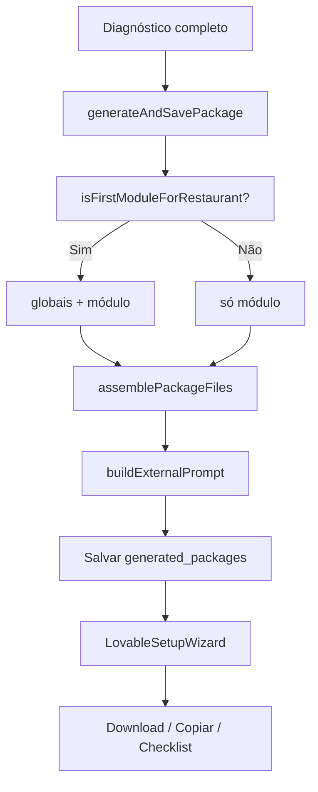

# Design: Assistente Lovable — pacote de arquivos + wizard de montagem

**Data:** 2026-06-20  
**Status:** Implementado  
**Escopo:** Geração de pacotes, tela de resultado pós-diagnóstico, downloads markdown

## Problema

Hoje a geração de Receita do Sistema:

1. **Não usa os blocos de conhecimento** do admin no caminho ativo (template fixo ignora `moduleMarkdown` e `globalRules`).
2. **Não está conectada a IA** (`ai-client` é mock / não implementado).
3. Entrega uma **receita longa em abas** sem ordem clara para o fluxo real no Lovable.
4. **Não gera arquivos** para o usuário anexar como contexto no Lovable.
5. O prompt final **não referencia arquivos** por nome.
6. Links para `/app/receitas-do-sistema/[id]` existem mas a **rota de detalhe não foi criada**.

O usuário leigo precisa de um caminho guiado: criar conta (1º módulo) → anexar arquivos → colar prompt em modo Planejar → executar e validar.

## Objetivo

Substituir o modelo “receita + abas” por um **pacote determinístico**:

- **Um arquivo `.md` por bloco de conhecimento**, com contexto das respostas do diagnóstico no topo.
- **Um prompt curto** que referencia os arquivos anexados e exige modo Planejar antes de implementar.
- **Assistente linear na tela de resultado** com 4 passos (3 em módulos adicionais).
- **Sem IA na geração do pacote** na v1 — montagem a partir de blocos + respostas.

## Decisões de produto

| Decisão | Escolha |
|---------|---------|
| Motor de geração v1 | Montagem determinística (sem chamada a LLM) |
| Granularidade dos arquivos | Um arquivo por `knowledge_block` |
| Contexto do cliente | Prepended no topo de **cada** arquivo |
| Arquivo de contexto dedicado | `00-contexto-restaurante.md` (resumo legível das respostas) |
| 1º módulo — arquivos | Globais (`base`, `global_rule`) + blocos do módulo + contexto |
| Módulos seguintes — arquivos | `00-contexto-restaurante.md` + blocos do módulo apenas |
| Base no projeto Lovable | Instruir usuário a **manter arquivos base** no projeto no 1º módulo |
| UI pós-geração | Wizard vertical de 4 passos (3 se não for 1º módulo) |
| Receita longa | Resumo colapsável opcional no topo; não é o foco |
| Progresso do wizard v1 | `localStorage` keyed por `package_id` |
| Checklist | Integrado ao passo 4; visível desde o início do passo |
| IA (Claude/OpenAI) | Fora de escopo desta spec — fase futura |
| Tutorial com imagens Lovable | v2 |

## Regra: primeiro módulo

Reutiliza a lógica já implementada em `lib/db/installations.ts` e `lib/services/package-generator.ts`:

```text
isFirstModule(restaurantId, currentModuleId?) =
  não existe instalação em user_module_installations
  com status IN (package_generated, implementation_started, installed, validated)
  para outro module_id do mesmo restaurante
```

- **Se primeiro módulo:** injeta `getGlobalKnowledgeBlocks()` + `getBlocksForModule(moduleId)`.
- **Se não:** apenas `getBlocksForModule(moduleId)`.

Ordem dos globais: `type = base` primeiro, depois `global_rule`, por `created_at`.

## Montagem dos arquivos

### Serviço: `lib/services/package-file-assembler.ts` (novo)

Entrada:

- `restaurantName`, `segment`
- `baseAnswers`, `moduleAnswers`
- `blocks: ModuleKnowledgeBlockWithBlock[]` (já resolvidos pelo `package-generator`)
- `isFirstModule: boolean`

Saída: `PackageFile[]`

```ts
interface PackageFile {
  filename: string       // ex: "01-estrutura-base.md"
  title: string          // título humano para UI
  content_markdown: string
  knowledge_block_id: string
  sort_order: number
}
```

### Nomenclatura dos arquivos

| Ordem | Filename | Origem |
|-------|----------|--------|
| 0 | `00-contexto-restaurante.md` | Gerado — resumo das respostas base + módulo |
| 1+ | `NN-{slug-do-bloco}.md` | Um por bloco ativo, ordenado por `order_index` / tipo |

Prefixo numérico garante ordem clara no Lovable e no prompt.

### Cabeçalho de contexto (em cada arquivo de bloco)

```markdown
# Contexto — {restaurantName}

**Segmento:** {segment}
**Respostas relevantes:**
- {pergunta}: {resposta formatada}
...

---

# {título do bloco}

{content_markdown do knowledge_block}
```

O arquivo `00-contexto-restaurante.md` contém apenas o resumo formatado (sem duplicar bloco inteiro).

### Formatação das respostas

- `single_choice` / `text` / `textarea`: valor direto
- `multiple_choice`: lista com vírgulas
- Chaves técnicas (`variable_key`) não aparecem na UI — usar `question_text` do diagnóstico quando disponível

## Prompt para ferramenta externa

Texto **curto**, gerado por template em `lib/services/package-prompt-builder.ts` (novo).

### Primeiro módulo

```markdown
Você está implementando o módulo **{moduleName}** para o restaurante **{restaurantName}**.

Anexei os seguintes arquivos de contexto — leia todos antes de responder:
- 00-contexto-restaurante.md
- 01-estrutura-base.md
- 02-regra-anti-duplicacao.md
- 03-regra-planejamento.md
- 04-{modulo-slug}.md

**Importante:** mantenha os arquivos de base e regras neste projeto. Eles serão consultados em módulos futuros.

**Não implemente nada ainda.**

Estou usando o modo **Planejar**. Responda com:
1. O que você entendeu da solicitação
2. O que encontrou no projeto atual
3. O que pretende reutilizar
4. O que pretende criar
5. O que pretende alterar
6. Quais riscos existem

Aguarde minha confirmação explícita antes de implementar.
```

### Módulo adicional

```markdown
Você está implementando o módulo **{moduleName}** para o restaurante **{restaurantName}**.

Os arquivos de base e regras globais já devem estar salvos neste projeto (implementados em módulo anterior pela metodologia IA da Casa). Consulte-os antes de criar estruturas novas.

Anexei apenas o arquivo deste módulo:
- 00-contexto-restaurante.md
- 04-{modulo-slug}.md

**Não implemente nada ainda.**

Estou usando o modo **Planejar**. [mesmas 6 perguntas de planejamento]

Aguarde minha confirmação explícita antes de implementar.
```

A lista de filenames no prompt deve ser **gerada dinamicamente** a partir de `files_json` — nunca hardcoded.

## Tela de resultado — Assistente Lovable

Substituir abas do `RecipeViewer` por componente `LovableSetupWizard`.

### Layout

```
┌────────────────────────────────────────────────────────┐
│  ✓ Pacote pronto — {moduleName}                        │
│  Siga os passos para montar no Lovable                 │
│  ●━━━○━━━○━━━○   Passo N de M                          │
└────────────────────────────────────────────────────────┘

[ Resumo colapsável — opcional ]

▼ Passo 1 — Criar conta no Lovable          (só 1º módulo)
▼ Passo 2 — Anexar arquivos
▶ Passo 3 — Colar prompt e modo Planejar
▶ Passo 4 — Executar e validar
```

### Passo 1 — Criar conta no Lovable *(somente `guide_variant === 'first_module'`)*

- Texto explicativo (conta própria, custo fora da IA da Casa)
- CTA primário: **Abrir lovable.dev** → `https://lovable.dev` (`target="_blank"`, `rel="noopener noreferrer"`)
- Instrução: criar conta com e-mail e senha
- Checkbox ≥44px: **"Já criei minha conta (ou já tenho)"** → desbloqueia passo 2

### Passo 2 — Anexar arquivos

**Na IA da Casa:**

- Lista `PackageFile` com botão **Baixar** por arquivo
- Botão **Baixar todos (.zip)**
- Aviso (1º módulo): manter arquivos base no projeto Lovable

**No Lovable (instruções inline):**

1. Abrir lovable.dev e entrar no projeto
2. Clicar **+**
3. **Anexar** → **Arquivo**
4. Selecionar arquivos baixados

- Checkbox: **"Anexei os arquivos no Lovable"** → desbloqueia passo 3

### Passo 3 — Colar prompt e modo Planejar

- `<pre>` com `prompt_for_external_tool`
- CTA: **Copiar prompt** (feedback visual <100ms)
- Instruções: colar → selecionar modo **Planejar** → enviar → revisar plano
- Dica: não autorizar implementação sem revisar
- Checkbox: **"Colei o prompt e enviei em modo Planejar"** → desbloqueia passo 4

### Passo 4 — Executar e validar

**No Lovable:**

- Texto: após revisar o plano, autorizar implementação
- Checkbox: **"O Lovable terminou de implementar"**

**Na IA da Casa (desde o início do passo 4):**

- Checklist interativo existente (`checklist_json`)
- Barra de progresso
- Mensagem ao completar 100%

### Comportamento do wizard

- Apenas o passo atual expandido; concluídos mostram ✓ e podem reabrir
- Progresso em `localStorage`: `lovable-wizard:{packageId}`
- `guide_variant` define se passo 1 existe e quantos arquivos listar
- Módulos adicionais: passos renumerados 1–3 na UI (sem “criar conta”)

### Diretrizes visuais

- Seguir tokens existentes (`#235139`, `#FFFDF9`, `#F5EEE1`, etc.)
- Ícones Lucide (ExternalLink, Download, Copy, Check) — sem emoji como ícone
- Mobile-first, botões full-width em telas estreitas
- Um CTA primário por passo
- `aria-current="step"` no passo ativo

## Alterações no backend

### `lib/services/package-generator.ts`

1. Manter busca de blocos e `isFirstModuleForRestaurant`.
2. Chamar `assemblePackageFiles()` e `buildExternalPrompt()`.
3. Remover dependência de `generateWithTemplate` hardcoded para ficha técnica.
4. `generateSystemRecipe` passa a ser thin wrapper ou é substituído por `assemblePackage`.

### `lib/ai/generate-system-recipe.ts`

- v1: delegar para montador determinístico.
- Manter `generateWithAI` atrás de `isAIConfigured()` para fase futura, mas não é caminho padrão.

### `generated_packages` — novo campo

```sql
alter table generated_packages
  add column if not exists files_json jsonb not null default '[]',
  add column if not exists guide_variant text not null default 'first_module'
    check (guide_variant in ('first_module', 'additional_module'));
```

`files_json`: array de `PackageFile` (sem campo binário — conteúdo markdown inline).

`package_markdown`: resumo curto gerado (1–2 parágrafos + lista do que será criado).

### Download ZIP

- Server action ou API route: `GET /api/packages/[id]/download-zip`
- Autenticado, valida que o pacote pertence ao restaurante do usuário
- Gera ZIP em memória com todos os `.md`

Download individual: blob client-side a partir de `files_json` (sem round-trip ao servidor).

## Rotas e páginas

| Rota | Ação |
|------|------|
| `app/(client)/app/receitas-do-sistema/[id]/page.tsx` | **Criar** — carrega pacote + `LovableSetupWizard` |
| `ModuleFlow.tsx` | Após gerar, pode manter inline wizard ou redirecionar para `[id]` |
| `RecipeViewer.tsx` | Refatorar para usar `LovableSetupWizard` ou deprecar |

**Recomendação:** após gerar, redirecionar para `/app/receitas-do-sistema/{id}` (URL compartilhável, histórico).

### `ModuleFlow.tsx`

- Remover banner fixo "Este é o seu primeiro módulo" — condicionar a `isFirstModule` (server prop)
- Atualizar loading copy para refletir montagem de arquivos (não "IA gerando")

## Fluxo de dados



## Edge cases

| Situação | Comportamento |
|----------|---------------|
| Módulo sem blocos ativos | Erro claro antes de salvar; não gerar pacote vazio |
| Bloco global arquivado | Não entra em `files_json` |
| Regerar mesmo módulo (único gerado) | Inclui globais + `guide_variant: first_module` |
| Regerar com outro módulo já gerado | Sem globais + `additional_module` |
| Mock sem Supabase | Mesma lógica via mocks |
| Usuário pula checkbox | Próximo passo permanece bloqueado |
| ZIP com muitos arquivos | v1: máx. ~10 arquivos — OK |

## Fora de escopo

- Integração Anthropic/OpenAI na geração do pacote
- Screenshots / GIFs do Lovable (v2)
- Salvar progresso do wizard no Supabase (v2)
- Versionamento automático de arquivos no projeto Lovable
- Geração de config inteligente no admin (`SYSTEM_PROMPT_MODULE_CONFIG`)

## Critérios de aceite

1. 1º módulo gera N arquivos: contexto + globais + blocos do módulo
2. 2º módulo gera apenas contexto + blocos do módulo
3. Cada arquivo de bloco tem contexto das respostas no topo
4. Prompt lista filenames corretos e exige modo Planejar
5. Wizard mostra 4 passos no 1º módulo, 3 nos seguintes
6. Passo 2 permite download individual e ZIP
7. Passo 3 copia prompt com feedback visual
8. Passo 4 mostra checklist desde o início
9. `/app/receitas-do-sistema/[id]` funciona
10. `source_blocks_json` / `files_json` refletem blocos usados
11. Template antigo de ficha técnica não é mais o caminho padrão
12. Banner "primeiro módulo" só aparece quando `isFirstModule === true`

## Testes manuais

- [ ] Restaurante novo → Ficha Técnica → 5+ arquivos, wizard 4 passos
- [ ] Mesmo restaurante → 2º módulo (quando existir) → menos arquivos, 3 passos
- [ ] Download ZIP contém todos os `.md`
- [ ] Prompt copiado lista nomes corretos
- [ ] Checklist persiste ao marcar itens
- [ ] Progresso wizard persiste ao recarregar página (localStorage)
- [ ] Link do histórico abre detalhe do pacote
- [ ] Admin edita bloco → nova geração reflete conteúdo atualizado

## Arquivos afetados (implementação)

| Arquivo | Ação |
|---------|------|
| `lib/services/package-file-assembler.ts` | Criar |
| `lib/services/package-prompt-builder.ts` | Criar |
| `lib/services/package-generator.ts` | Alterar |
| `lib/ai/generate-system-recipe.ts` | Simplificar / delegar |
| `components/recipes/LovableSetupWizard.tsx` | Criar |
| `components/recipes/RecipeViewer.tsx` | Refatorar ou substituir |
| `app/(client)/app/receitas-do-sistema/[id]/page.tsx` | Criar |
| `app/(client)/app/solucoes/[slug]/ModuleFlow.tsx` | Alterar |
| `app/actions/packages.ts` | Salvar `files_json`, `guide_variant` |
| `types/database.ts` | Tipos novos |
| `docs/iadacasa/migrations/03_package_files_json.sql` | Criar |

## Próximo passo

Após aprovação desta spec → criar plano de implementação com skill `writing-plans`.
